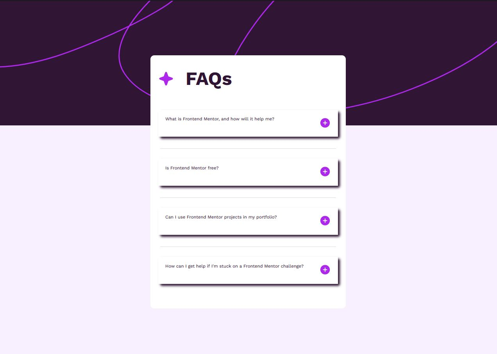

<!-- Sapanish -->
# Day19

_FAQ Accordion

## Desarrollado utilizando la metododologia Mobile First
_Utilización de medias querie la cual permite obtener una vista responsive la cual se adapta a dispositivos moviles tabletas etc.

_Para la distribución de el contenido dentro de la tarjeta se utilizo FlexBox
_Lenguaje de programación JS el cual permite crear funcionalidades que van del lado del backend.

## Comenzando 🚀

_Mediante las siguientes instrucciones puedes tener acceso al reto, funciona en cualquier maquina y dispositivo móvil

_Se adapta perfectamente a moviles tablets y escritorio

### Pre-requisitos 📋
### Requisitos 📋
_Computadora sea de escritorio o portatil asi como también dispositivos moviles que tengan accesoa internet

## Ejecutando las pruebas ⚙️

_Abrir cualquier navegador y ingresar la siguiente url:
https://dyegho.github.io/day19/accordion.html

## Capturas de pantalla
# Mobile

# Desktop

# Desarrollador ⚙️
    Diego Pitizaca 
    
## Agradecimientos
* Fronted Club (100DaysOfProject)
* Frontend Challenge

_Los cuales me han exigido un estudio diferente en la manera de diseñar un componente web incrementando día a dia mi pasión por el diseño y apegamiento a las exigencias de la actualidad en el campo del desarrolo WEB. Mediante el cual día a día voy descubriendo nuevas habiliadades.

<!-- English -->

# Day19

_FAQ ACORDION

## Developed using Mobile First methodology.
Use of media querie which allows to obtain a responsive view which adapts to mobile devices, tablets etc.

FlexBox was used for the distribution of the content inside the card.
JS programming language which allows to create backend functionalities.

## Getting started 🚀

Using the following instructions you can access the challenge, it works on any machine and mobile device.

It adapts perfectly to mobile tablets and desktop.

### Pre-requisites 📋
### Requirements 📋
Desktop or laptop computer as well as mobile devices that have internet access.

## Running the tests ⚙️

Open any browser and enter the following url:
https://dyegho.github.io/day19/accordion.html

## Screenshots
## Mobile

# Desktop

# Developer ⚙️
    Diego Pitizaca 
    
## Acknowledgements
* Fronted Club (100DaysOfProject)
* Frontend Challenge

These have demanded me a different study in the way of designing a web component, increasing day by day my passion for design and adherence to the demands of today in the field of web development.
In this journey of coding starts new challenges to keep improving.

